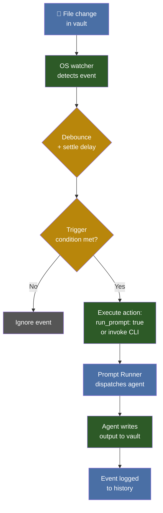

# 🔌 Hook System — The Reactive Layer

> Hooks are **event-based, reactive triggers** that fire predefined actions when a specific event occurs. Unlike agents (autonomous, decision-making), hooks are deterministic — if A happens, execute B. They form the **nervous system** of vault automation.

---

## Hook vs. Agent

| Characteristic | Hook | Agent |
|----------------|------|-------|
| **Nature** | Static, deterministic | Dynamic, cognitive |
| **Initiative** | Reactive — waits for event | Proactive — decides how and when |
| **Workflow** | Linear (if A → B) | Non-linear (can pivot, retry) |
| **Resource cost** | Low | High (tokens per decision) |
| **State** | Stateless or minimal | Session-aware, persistent goals |

---

## How a Hook Works



---

## The Watcher Infrastructure

All filesystem hooks share a common infrastructure:

| Component | Detail |
|-----------|--------|
| **Library** | `watchdog` (Python) — specifically `PollingObserver` for network drives |
| **Debounce** | 30 seconds per file — prevents duplicate triggers |
| **Settle delay** | 2 seconds — Obsidian writes files in two phases |
| **State tracking** | `state.json` keyed by file modification time |
| **Excluded directories** | `.obsidian`, `.trash`, `.git`, `node_modules` |

---

## Active Hooks in the YellowVault

| Hook | Event | Trigger | Action |
|------|-------|---------|--------|
| **Prompt Runner Watcher** | File modified | `run_prompt: true` in frontmatter | Dispatch to configured agent/engine |
| **Vault Root File Watcher** | New file in root | German word stub pattern | Fill vocabulary card via DeepSeek |
| **Daily Note Trigger** | Time-based | 07:00 daily + logon +10 min | Generate Tageszusammenfassung |
| **Neue Sätze Watcher** | File modified | New date section in Neue Sätze.md | Annotate words with translations |
| **Wörter Stammverzeichnis** | File modified | New word in master index | Trigger Wörter-Scout pipeline |

---

## Anatomy of a Hook Configuration

A hook is defined by four elements:

```json
{
  "hook_name": "Prompt Runner Watcher",
  "event_type": "filesystem",
  "watch_path": "C:/Vaults/YellowVault/",
  "trigger": {
    "condition": "frontmatter.run_prompt == true",
    "file_pattern": "*.md",
    "debounce_seconds": 30
  },
  "action": {
    "type": "set_frontmatter",
    "field": "runner_status",
    "value": "pending"
  }
}
```

---

## Design Patterns

### 1. Watch → Trigger → Execute (Decoupled)

Three separate components with one responsibility each:

| Component | Responsibility |
|-----------|---------------|
| **Watcher** | Watches for file changes |
| **Trigger** | Checks conditions, sets flags |
| **Executor** | Runs the prompt or agent |

This makes debugging trivial: if a prompt didn't run, check which component failed.

### 2. Silent on No-Op

Hooks should produce **zero output** when the trigger condition is not met. No logs, no errors, no notifications. Only fire when there's work to do.

### 3. Log Everything

Every hook execution should be logged:
- What file changed
- What condition was checked
- What action was taken
- What the result was

---

## Benefits of a Hook System

- **Zero-latency response**: Actions fire within seconds of a file change
- **No manual steps**: The vault responds to itself
- **Modular**: Add or remove hooks without affecting other systems
- **Observable**: Every event is logged and traceable

---

## Related

- [[Projekte/Hook Shop|🪝 RA Hook Shop — buy pre-built hooks]]
- [[AI Ecosystem|AI Ecosystem — the full system overview]]
- [[Projekte/Cron Shop|⏰ RA Cron Shop — scheduled automations]]
