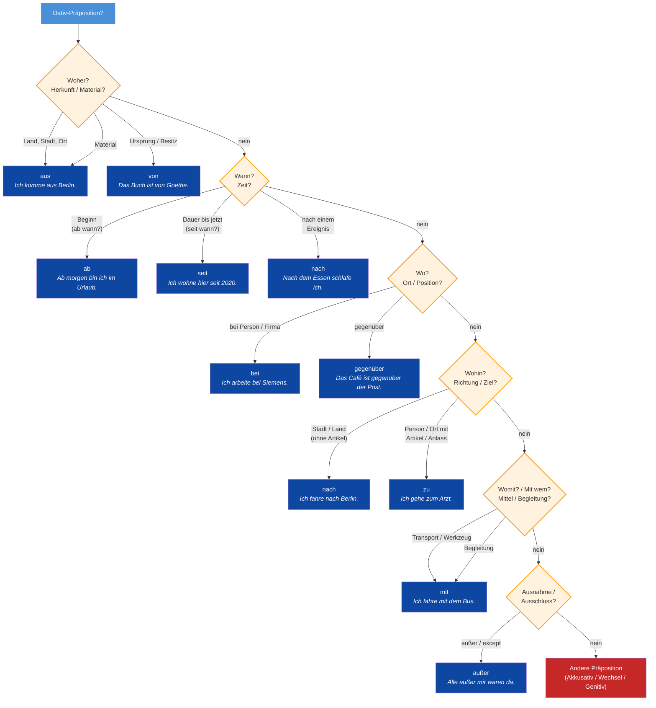

# Dativ Präpositionen — Der vollständige Guide

> [!info]- Reglas clave del flowchart
> 1. **aus** → Herkunft (Land, Stadt, Gebäude) o Material
> 2. **von** → Ursprung, Autor, Besitz (von + Dativ como genitivo coloquial)
> 3. **ab** → Beginn temporal o local (ab morgen, ab Berlin)
> 4. **seit** → Duración desde un punto en el pasado hasta AHORA
> 5. **nach** → Dirección (ciudades/países sin artículo) o posterioridad temporal
> 6. **bei** → Cercanía física, persona, empresa, o actividad en curso
> 7. **gegenüber** → Posición enfrente o comparación
> 8. **zu** → Destino (persona, lugar con artículo, evento) o finalidad
> 9. **mit** → Medio de transporte, herramienta, o compañía
>10. **außer** → Exclusión (todos menos X)

---

## Präpositionen-Tabelle

| Präposition | Funktion | Fragewort | Beispiel |
|---|---|---|---|
| **ab** | Beginn (Zeit/Ort) | Ab wann? / Ab wo? | *Ab morgen habe ich Urlaub.* |
| **aus** | Herkunft / Material | Woher? / Woraus? | *Er kommt aus Deutschland.* |
| **außer** | Ausschluss | Außer wem? | *Außer ihm war niemand da.* |
| **bei** | Nähe / Person / Firma | Bei wem? | *Ich wohne bei meinen Eltern.* |
| **gegenüber** | Position / Vergleich | Wem gegenüber? | *Das Café ist gegenüber der Bank.* |
| **mit** | Mittel / Begleitung | Womit? / Mit wem? | *Ich fahre mit dem Auto.* |
| **nach** | Richtung / Zeit | Wohin? / Wann? | *Wir fahren nach Berlin.* |
| **von** | Ursprung / Zugehörigkeit | Von wem? | *Das Geschenk ist von ihm.* |
| **seit** | Dauer bis jetzt | Seit wann? | *Ich wohne hier seit einem Jahr.* |
| **zu** | Ziel / Anlass | Zu wem? / Wozu? | *Ich gehe zu meiner Oma.* |

---

## **ab** — Beginn eines Zeitpunkts oder Orts

| Beispiel | Übersetzung |
|---|---|
| *Ab morgen habe ich Urlaub.* | From tomorrow I have vacation. |
| *Ab Berlin fährt der Zug nach Hamburg.* | From Berlin the train goes to Hamburg. |
| *Ab 18 Jahren ist der Eintritt frei.* | From 18 years entry is free. |

## **aus** — Herkunft oder Material

| Beispiel | Übersetzung |
|---|---|
| *Er kommt aus Deutschland.* | He comes from Germany. |
| *Die Flasche ist aus Glas.* | The bottle is made of glass. |
| *Ich komme gerade aus dem Büro.* | I just came from the office. |

## **außer** — Ausschluss

| Beispiel | Übersetzung |
|---|---|
| *Außer ihm war niemand da.* | No one was there except him. |
| *Ich esse alles außer Fisch.* | I eat everything except fish. |
| *Außer montags hat das Museum geöffnet.* | Except Mondays the museum is open. |

## **bei** — Nähe, Person oder Firma

| Beispiel | Übersetzung |
|---|---|
| *Ich wohne bei meinen Eltern.* | I live with my parents. |
| *Er arbeitet bei Siemens.* | He works at Siemens. |
| *Hast du Geld bei dir?* | Do you have money on you? |

## **gegenüber** — Position oder Vergleich

| Beispiel | Übersetzung |
|---|---|
| *Das Café ist gegenüber der Bank.* | The café is opposite the bank. |
| *Gegenüber früher ist es jetzt besser.* | Compared to before, it's better now. |
| *Sie wohnt gegenüber vom Park.* | She lives across from the park. |

## **mit** — Mittel oder Begleitung

| Beispiel | Übersetzung |
|---|---|
| *Ich fahre mit dem Auto.* | I go by car. |
| *Sie geht mit ihrem Freund ins Kino.* | She goes to the cinema with her boyfriend. |
| *Mit freundlichen Grüßen* | With kind regards |

## **nach** — Richtung oder Zeit

| Beispiel | Übersetzung |
|---|---|
| *Wir fahren nach Berlin.* | We're going to Berlin. |
| *Nach dem Essen gehen wir spazieren.* | After eating we go for a walk. |
| *Meiner Meinung nach ist das richtig.* | In my opinion that's correct. |

## **von** — Ursprung oder Zugehörigkeit

| Beispiel | Übersetzung |
|---|---|
| *Das Geschenk ist von ihm.* | The gift is from him. |
| *Der Brief kommt von meiner Schwester.* | The letter comes from my sister. |
| *Das ist das Auto von meinem Vater.* | That's my father's car. |

## **seit** — Dauer bis zur Gegenwart

| Beispiel | Übersetzung |
|---|---|
| *Ich wohne hier seit einem Jahr.* | I've been living here for a year. |
| *Seit gestern regnet es.* | It's been raining since yesterday. |
| *Seit wann lernst du Deutsch?* | Since when have you been learning German? |

## **zu** — Ziel oder Anlass

| Beispiel | Übersetzung |
|---|---|
| *Ich gehe zu meiner Oma.* | I go to my grandma's. |
| *Wir fahren zu einer Hochzeit.* | We're going to a wedding. |
| *Zum Glück hat es nicht geregnet!* | Luckily it didn't rain! |
