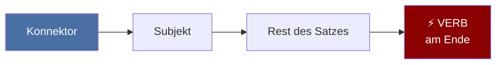

# 📎 Nebensätze — weil, dass, wenn, obwohl

> Ein **Nebensatz** ist ein grammatikalisch abhängiger Satz, der **nicht allein stehen kann**. Er gibt zusätzliche Informationen und ist mit einem Hauptsatz verbunden.

**Die goldene Regel:** Das konjugierte Verb steht **immer am Ende** des Nebensatzes.

---

## Die Goldene Regel

**Struktur:** `[Konnektor] + [Subjekt] + [Rest des Satzes] + VERB`

---

## Nebensatz-Konnektoren

| Konnektor | Funktion | Beispiel |
|-----------|----------|----------|
| **weil** | Grund (Kausal) | *... weil ich müde **bin**.* |
| **da** | Grund (formaler) | *... da ich kein Geld **habe**.* |
| **dass** | Aussage, Tatsache | *... dass ich Deutsch **lerne**.* |
| **wenn** | Bedingung / Zeit | *... wenn ich Zeit **habe**.* |
| **als** | einmalige Vergangenheit | *... als ich in Berlin **ankam**.* |
| **obwohl** | Gegensatz (Konzessiv) | *... obwohl es regnet.* |
| **ob** | indirekte Frage (ja/nein) | *... ob er **kommt**.* |
| **damit** | Zweck (final) | *... damit ich besser **verstehe**.* |

---

## Position im Satz

Ein Nebensatz kann vor oder nach dem Hauptsatz stehen:

### Nebensatz nach dem Hauptsatz

> *Ich bleibe zu Hause, **weil ich krank bin**.*

| Hauptsatz | , | Nebensatz |
|-----------|---|-----------|
| Ich bleibe zu Hause | , | weil ich krank **bin** |

### Nebensatz vor dem Hauptsatz

> ***Weil ich krank bin**, bleibe ich zu Hause.*

| Nebensatz | , | Hauptsatz |
|-----------|---|-----------|
| Weil ich krank **bin** | , | **bleibe** ich zu Hause |

> [!tip] Wenn der Nebensatz vorne steht
> Das konjugierte Verb im Hauptsatz kommt **direkt nach dem Komma** (Verb-Zweit-Stellung).

---

## Mehrteilige Verben im Nebensatz

Wenn es zwei Verben gibt, stehen **beide am Ende**:

**Struktur:** `[Konnektor] + ... + [Infinitiv/Partizip] + [konjugiertes Verb]`

| Satz | Verbposition |
|------|-------------|
| *Ich hoffe, dass ich dich bald **sehen werde**.* | Infinitiv + konjugiert |
| *..., weil ich das Buch gestern **gelesen habe**.* | Partizip + konjugiert |
| *..., obwohl ich das nicht **hätte sagen sollen**.* | Drei Verben am Ende |

---

## Die wichtigsten Konnektoren im Überblick

| Konnektor | Satztyp | Verbposition |
|-----------|---------|-------------|
| **weil** | Nebensatz | Ende |
| **da** | Nebensatz (formell) | Ende |
| **dass** | Nebensatz | Ende |
| **wenn** | Nebensatz | Ende |
| **als** | Nebensatz | Ende |
| **obwohl** | Nebensatz | Ende |
| **ob** | Nebensatz | Ende |
| **damit** | Nebensatz | Ende |
| **denn** | Hauptsatz | Position 2 (kein Nebensatz!) |
| **aber** | Hauptsatz | Position 2 |
| **und** | Hauptsatz | Position 2 |

> [!warning] **weil** vs. **denn**
> *Ich lerne Deutsch, **weil** ich in Deutschland **leben möchte**.* (Verb am Ende)
> *Ich lerne Deutsch, **denn** ich **möchte** in Deutschland leben.* (Verb an Position 2)

---

## Übung: Sätze bilden

1. Ich lerne Deutsch. Ich möchte in Deutschland leben. (weil)
   → *Ich lerne Deutsch, **weil** ich in Deutschland leben **möchte**.*

2. Ich habe keine Zeit. Ich kann nicht kommen. (weil)
   → *Ich kann nicht kommen, **weil** ich keine Zeit **habe**.*

3. Es regnet. Ich gehe spazieren. (obwohl)
   → *Ich gehe spazieren, **obwohl** es **regnet**.*

4. Hast du morgen Zeit? Wir können ins Kino gehen. (wenn)
   → ***Wenn** du morgen Zeit **hast**, können wir ins Kino gehen.*

5. Er sagt etwas. Er ist nicht da. (obwohl)
   → *Er sagt, **dass** er nicht da **ist**.*

---

## Related

- [[Deutsch/Grammatik/Vorgangspassiv\|🔁 Vorgangspassiv — werden-Passiv]]
- [[Deutsch/Grammatik/Trennbare-Verben\|🔧 Trennbare Verben]]
- [[Deutsch/Grammatik/Modalverben\|⚡ Modalverben]]
- [[Mental Maps/index\|🧠 Mental Maps — Grammatik visuell]]
