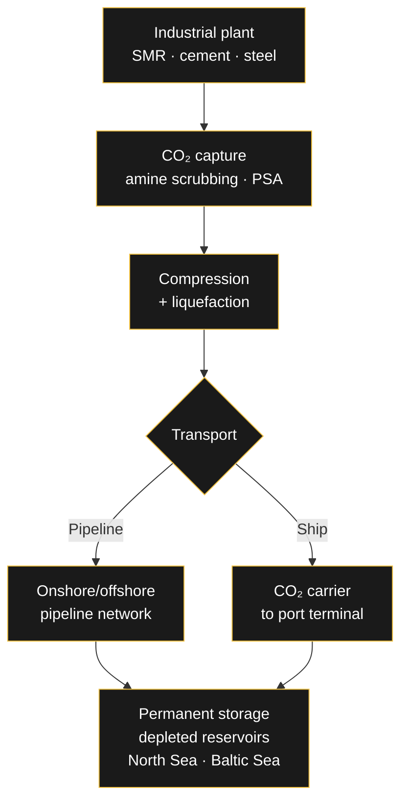

# 🗺️ The CO₂ Value Chain

> Capturing CO₂ is the easy part. Transporting it hundreds of kilometers and storing it permanently — that's where CCS projects succeed or die. Germany just made its biggest regulatory pivot in decades to build this chain, and the cost data is still being written in real time.

---

## The Chain: Capture → Transport → Storage

Carbon Capture and Storage (CCS) applied to industrial processes works in three stages:

Each stage has its own economics, regulation, and risk profile. Capture is the most mature; storage is the most policy-dependent; transport is where the infrastructure gap lives.

---

## Germany's Regulatory Pivot

Until late 2025, **storing CO₂ in Germany was effectively prohibited** — including in natural geological formations on national territory, due to environmental concerns under the original Carbon Dioxide Storage Act.

Then Germany reformed the rules to pave the way for **large-scale CCS**:

- **Offshore storage** (North Sea, Baltic Sea seabed) is now permitted
- **Onshore storage** can be permitted if the individual federal states agree
- This marks a turning point for commercial CCS projects beyond research/demonstration scale

The legal framework aligns with Germany's climate law: **net-zero GHG emissions by 2045**, and net-negative after 2050.

> [!note] RA
> This is the change that makes blue hydrogen viable in Germany. Before the 2025 reform, a blue hydrogen plant had no legal answer to the question "where does the CO₂ go?"

---

## The Cost Reality: Data Is Still Being Written

Reliable market data on long-term CO₂ transport and storage costs **does not yet exist** — it's a young market. The clearest signal comes from cost assumptions for blue hydrogen economics:

| Period | CO₂ transport & storage cost (NW Europe) |
|---|---|
| Before mid-2024 | ~$20 / t CO₂ |
| After mid-2024 | ~$60 / t CO₂ |

The **tripling of cost assumptions** (Argus data) reflects early-market realities: scarce capacity, first-mover pricing, and higher costs for storage sites further from the coast. For a blue hydrogen plant, this line item can make or break the business case — at 10 kg CO₂ per kg H₂, transport and storage alone add $0.20–0.60 per kg of hydrogen.

---

## The Infrastructure: North Sea Corridors

Germany's strategy centers on storage in the **North Sea** and neighboring countries. Four major pipeline initiatives are underway:

| Project | Partners | Route | Status |
|---|---|---|---|
| OGE–Ontras JV | OGE, Ontras | Eastern Germany → German North Sea / Denmark | Planning |
| North Sea CO₂ Corridor | OGE, Fluxys | Southern/Western Germany → Belgian border → Zeebrugge → offshore | Planning |
| Delta Rhine Corridor | Shell, Gasunie, OGE | Rhine-Ruhr → Dutch North Sea | Planning |
| Schleswig-Holstein Section | — | 28 km pipeline, northern Germany | Most advanced — operations ~2029 |

A cross-border pipeline from **Southern Germany to Belgium** (Fluxys Belgium, Wintershall Dea, OGE) is also in development to support industrial decarbonization.

---

## Why the CO₂ Value Chain Decides Blue Hydrogen

The stakeholder analysis of hydrogen projects makes this brutally clear: the **CO₂ value chain (transport & storage) is a high-power, high-urgency stakeholder**. If there's no storage access, the blue pathway fails regardless of policy support, technology, or carbon prices.

The chain also explains the sequencing of Germany's CCS buildout:

1. **First**: pipeline segments where industrial clusters meet the coast (Schleswig-Holstein 2029)
2. **Then**: cross-border corridors connecting inland industry to North Sea storage
3. **Finally**: the market matures — prices stabilize, capacity scales, and blue hydrogen costs become predictable

---

## Related

- [[Engineering/Direct-Air-Capture|🌿 Direct Air Capture (DAC)]]
- [[Engineering/SMR|🏭 Steam Methane Reforming (SMR)]]
- [[Engineering/Hydrogen-Pathways|🧪 Hydrogen Production Pathways]]
- [[Engineering/Stakeholder-Analysis-Hydrogen|🤝 Stakeholder Analysis in Hydrogen Projects]]

---

*The CO₂ value chain is the least glamorous, most decisive part of CCS — pipelines and pore space decide what capture technology gets to do. Where do you think Germany's first storage sites will actually open?*
