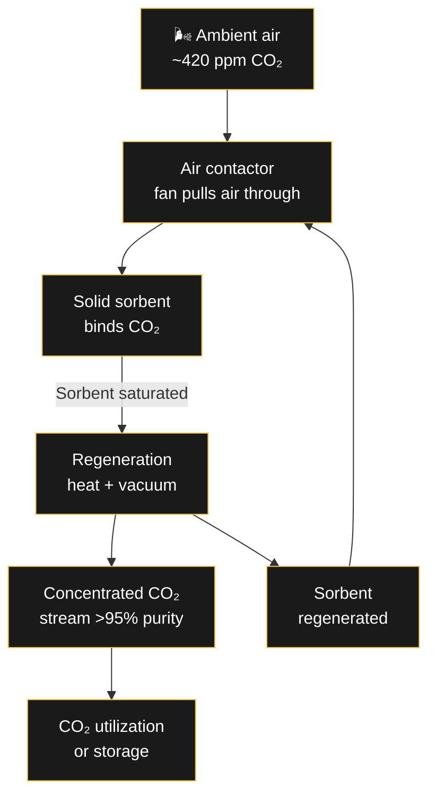
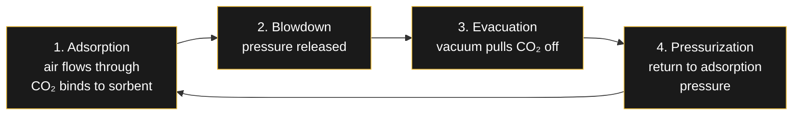

# 🌿 Direct Air Capture (DAC)

> Direct Air Capture (DAC) is a technology that captures carbon dioxide (CO₂) directly from the ambient air — not from a concentrated source like a power plant smokestack. It is one of the most discussed negative emissions technologies for climate change mitigation.

---

## How DAC Works

DAC systems pull air through a **solid sorbent** material that selectively binds CO₂ molecules. Once the sorbent is saturated, the system applies heat or vacuum to release the captured CO₂ as a concentrated stream.

---

## PVSA — Pressure & Vacuum Swing Adsorption

One of the most promising DAC configurations uses **Pressure & Vacuum Swing Adsorption (PVSA)** — a cyclic process that alternates between adsorption and regeneration by changing the pressure.

### The Skarstrom Cycle

The Skarstrom cycle is a 4-step process originally developed for gas separation, now adapted for DAC:

| Step | Action | Pressure | Duration |
|------|--------|----------|----------|
| **Adsorption** | Air flows through sorbent bed, CO₂ is captured | Atmospheric (~1 bar) | Minutes |
| **Blowdown** | Pressure released to near-ambient | 1 bar → ambient | Seconds |
| **Evacuation** | Vacuum pump pulls CO₂ from sorbent | ~0.1-0.3 bar | Minutes |
| **Pressurization** | Bed repressurized for next cycle | Ambient → 1 bar | Seconds |

---

## Adsorbent Materials

The key to DAC performance is the **solid sorbent** — the material that captures CO₂. Three main classes:

| Type | Material | Advantages | Challenges |
|------|----------|------------|------------|
| **Amine-functionalized** | Amine groups on porous supports (silica, alumina) | High selectivity, well-understood chemistry | Degradation from oxygen, thermal stability |
| **Metal-Organic Frameworks (MOFs)** | Crystalline porous structures with metal centers | Tunable pore size, high surface area | Cost, scalability, moisture sensitivity |
| **Carbon-based** | Activated carbon, biochar | Low cost, stable, abundant | Lower selectivity, requires more energy |

---

## Lab-Scale DAC System Design

A lab-scale PVSA system for DAC typically consists of:

| Component | Purpose | Specification |
|-----------|---------|---------------|
| **Air contactor** | Moves air through sorbent | Fan + ductwork, ~1-10 m³/min for lab scale |
| **Sorbent column** | Houses the adsorbent material | Packed bed, temperature controlled |
| **Vacuum pump** | Pulls CO₂ during regeneration | ~0.1 bar absolute, ~100-500 W |
| **Heating element** | Aids CO₂ desorption (TSA hybrid) | ~50-100°C for amine sorbents |
| **CO₂ analyzer** | Measures output concentration | NDIR sensor, 0-100% range |
| **Data acquisition** | Logs cycle parameters | Temperature, pressure, flow, concentration |

---

## Why DAC Matters

- **Negative emissions:** Removes CO₂ that was already emitted — not just preventing new emissions
- **Location-independent:** Can be sited anywhere, unlike point-source capture
- **Scalable:** Modular design — stack units to increase capacity
- **Utilization:** Captured CO₂ can be used for synthetic fuels, enhanced oil recovery, or permanent storage

### Current challenges

- **Energy intensity:** ~200-300 kWh per tonne of CO₂ captured
- **Cost:** Currently $250-600/tonne, targeting $100/tonne at scale
- **Water consumption:** Higher in humid climates due to water adsorption competition
- **Sorbent lifetime:** Degradation over thousands of cycles

---

## The NeoCarbon Pilot

NeoCarbon is one of the companies piloting DAC technology in Germany. Their approach uses existing cooling tower infrastructure to reduce air contactor costs — a smart integration strategy that addresses one of DAC's biggest capital expenses.

---

## Related

- [[Engineering/Hydrogen-Pathways|🧪 Hydrogen Production Pathways]]
- [[Wirtschaft/CO2-Kosten|🌍 CO₂ Costs and Their Impact on German Electricity Prices]]
- [[Wirtschaft/Merit-Order-System|⚡ How Germany's Electricity Market Sets Prices]]

---
*DAC is still expensive — €600-1000/t CO₂ — but costs are falling fast. At what price does it become viable where you are?*
