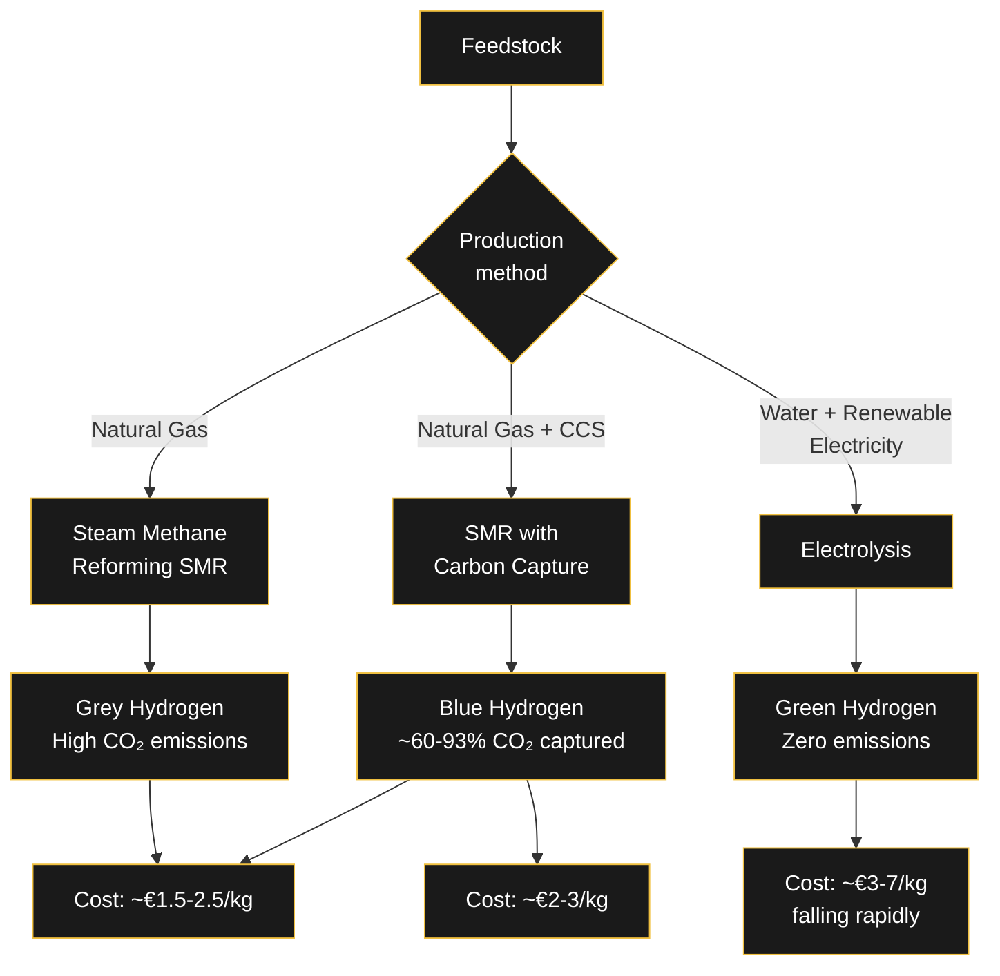

# 🧪 Hydrogen Production Pathways

> Hydrogen is becoming a strategic decarbonization fuel for industry, transport, power generation, and heating. But not all hydrogen is created equal — the production method determines the emissions, cost, and scalability.

---

## The Three Colors of Hydrogen



---

## Grey Hydrogen

**Process:** Steam Methane Reforming (SMR) of natural gas — the dominant method today.

```
CH₄ + H₂O → CO + 3H₂  (reforming, endothermic)
CO + H₂O → CO₂ + H₂    (water-gas shift)
```

**Emissions:** ~9-10 kg CO₂ per kg H₂ — significant, all released to atmosphere.

**Cost:** €1.5-2.5/kg — the cheapest option but incompatible with climate targets.

**Maturity:** Fully commercial, decades of optimization.

---

## Blue Hydrogen

**Process:** Same SMR process, but with carbon capture and storage (CCS) attached.

**Capture rates:**
- 60% capture: relatively simple retrofit
- 93% capture: requires additional process steps (pressure swing adsorption, amine scrubbing)

**Emissions:** 0.6-4 kg CO₂ per kg H₂ depending on capture rate.

**Cost:** €2-3/kg — depends on natural gas prices and CO₂ certificate costs.

**Key infrastructure:** Requires CO₂ transport and storage — a significant bottleneck.

---

## Green Hydrogen

**Process:** Water electrolysis powered by renewable electricity.

```
2H₂O → 2H₂ + O₂  (electrolysis)
```

**Technologies:**
- **Alkaline electrolysis** — mature, large-scale, ~60-70% efficiency
- **PEM electrolysis** — flexible, compact, ~60-70% efficiency
- **Solid oxide electrolysis** — high-temperature, ~80-85% efficiency, pre-commercial

**Emissions:** Zero if powered by renewables. Depends on grid mix otherwise.

**Cost:** €3-7/kg — falling rapidly as electrolyzer manufacturing scales.

**The key challenge:** Requires massive amounts of renewable electricity. Producing 1 kg of green hydrogen needs ~50-55 kWh of electricity.

---

## The European Hydrogen Backbone

The European Hydrogen Backbone (EHB) is a planned infrastructure network connecting hydrogen producers, consumers, and storage across Europe.

| Country | Operator | Status |
|---------|----------|--------|
| Germany | OGE, Gascade, Open Grid Europe | Planning |
| Netherlands | Gasunie | Planning |
| France | GRTgaz, Terega | Planning |
| Denmark | Energinet | Planning |
| Sweden | Nordion Energi | Planning |

The EHB repurposes existing natural gas pipelines (up to 100% hydrogen blending in some cases) and builds new dedicated hydrogen pipelines where needed.

---

## Why Hydrogen Matters for Germany

Germany's industrial base (steel, chemicals, refining) is hard to electrify. Hydrogen is the primary decarbonization pathway for:

- **Steel production** — replacing coking coal with hydrogen in direct reduction
- **Chemical feedstocks** — ammonia, methanol production
- **Heavy transport** — shipping, aviation, long-haul trucking
- **Power generation** — seasonal storage and backup for renewable intermittency

---

## Related

- [[Wirtschaft/Merit-Order-System|⚡ How Germany's Electricity Market Sets Prices]]
- [[Wirtschaft/CO2-Kosten|🌍 CO₂ Costs and Their Impact on German Electricity Prices]]
- [[Engineering/Direct-Air-Capture|🌿 Direct Air Capture (DAC)]]

---
*Which hydrogen pathway will dominate in 2030? I'm betting on blue with CCS bridging to green. What's your take?*
