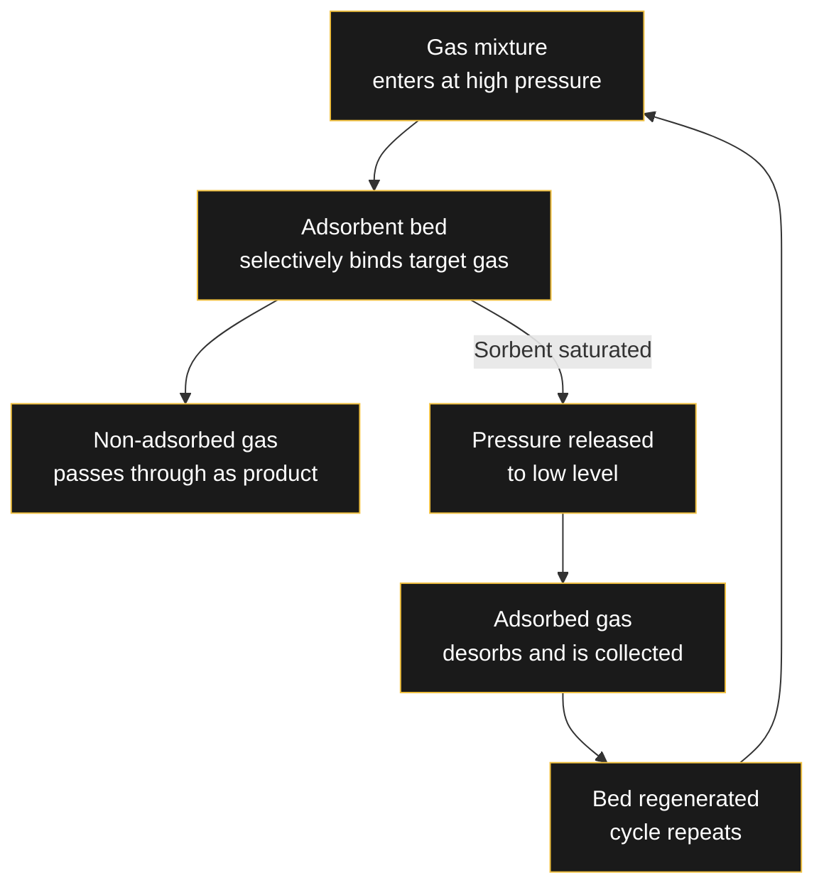
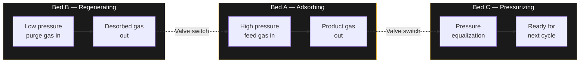

# 💨 Pressure Swing Adsorption (PSA)

> Pressure Swing Adsorption (PSA) is a cyclic gas separation technology that relies on the fact that different gases have different affinities for solid adsorbent materials — and this affinity changes with pressure.

By cyclically increasing and decreasing the pressure of a gas mixture in contact with the adsorbent, we can selectively adsorb and then release specific gas components — achieving separation without heat, solvents, or cryogenic temperatures.

---

## Core Principle

---

## The PSA Cycle

### Step 1: Adsorption (High Pressure)

A gas mixture is fed into a vessel containing the adsorbent material. The pressure is raised (typically several atmospheres above ambient). Gas components with stronger affinity for the adsorbent are preferentially retained.

### Step 2: Desorption (Low Pressure)

Once the adsorbent bed is saturated, the feed stops and pressure is reduced to near-atmospheric. The lower pressure weakens binding forces, releasing the adsorbed gas.

---

## Cyclic Operation with Multiple Beds

To achieve **continuous** product flow, PSA systems use multiple adsorbent beds operating out of phase:

---

## Key Factors Influencing Performance

| Factor | Impact |
|--------|--------|
| **Adsorbent material** | Determines selectivity — different materials for different gases (zeolites, activated carbon, MOFs) |
| **Operating pressure** | Higher pressure → more adsorption; lower pressure → better regeneration |
| **Temperature** | PSA operates at near-ambient — advantage over cryogenic separation |
| **Cycle time** | Shorter cycles → higher throughput but lower purity |
| **Number of beds** | More beds → smoother continuous operation but higher capital cost |
| **Feed composition** | Concentration of target gas significantly affects efficiency |

---

## Applications

| Application | What is Separated | Typical Adsorbent |
|-------------|-------------------|-------------------|
| **Hydrogen purification** | H₂ from reformate gas (SMR offgas) | Activated carbon, zeolites |
| **Oxygen generation** | O₂ from air | Zeolite (N₂ selective) |
| **Nitrogen generation** | N₂ from air | Carbon molecular sieve |
| **CO₂ capture** | CO₂ from flue gas / biogas | Amine-functionalized, zeolites |
| **Natural gas upgrading** | CH₄ from CO₂ / N₂ | Activated carbon, zeolites |

---

## PSA vs. Other Separation Technologies

| Aspect | PSA | Cryogenic Distillation | Amine Scrubbing | Membrane |
|--------|-----|----------------------|----------------|----------|
| **Temperature** | Ambient | -160 to -190°C | 40-60°C | Ambient |
| **Energy source** | Compression | Refrigeration | Heat (steam) | Compression |
| **Scale** | Small to medium | Large | Large | Small to medium |
| **Purity** | 95-99.9% | >99.9% | >99% | 90-98% |
| **Maturity** | Commercial | Commercial | Commercial | Emerging |

---

## Variations

- **Pressure Equalization** — connects beds at intermediate pressures to recover energy
- **Rapid PSA (RPSA)** — shorter cycle times, smaller beds, more compact systems
- **Vacuum Swing Adsorption (VSA)** — uses vacuum instead of pressure swing
- **Pressure & Vacuum Swing Adsorption (PVSA)** — combines both, used in DAC

> For DAC-specific PVSA: [[Engineering/Direct-Air-Capture|🌿 Direct Air Capture — PVSA and the Skarstrom Cycle]]

---

## Why PSA Matters

- **Relatively simple technology** — no solvents, no cryogenics, no heat
- **Modular and scalable** — from small medical oxygen generators to industrial hydrogen plants
- **Low operating cost** — mainly electricity for compression
- **Low environmental impact** — no chemical waste, no water consumption

---

## Related

- [[Engineering/Direct-Air-Capture|🌿 Direct Air Capture (DAC)]]
- [[Engineering/Hydrogen-Pathways|🧪 Hydrogen Production Pathways]]
- [[Engineering/index|Engineering & Technology]]
