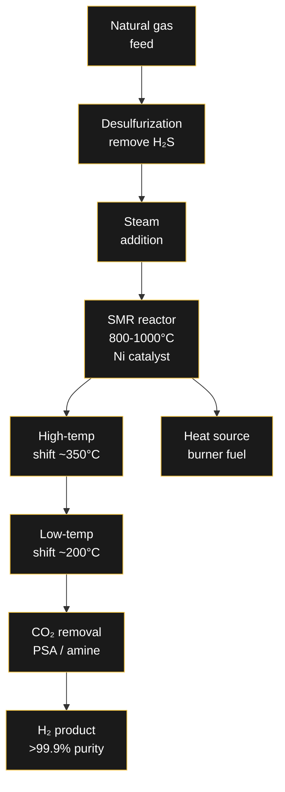

# 🏭 Steam Methane Reforming (SMR)

> Steam Methane Reforming (SMR) is the most widely used method for producing hydrogen — accounting for ~70% of global hydrogen production. It reacts natural gas (methane) with steam at high temperature to produce hydrogen and carbon monoxide.

---

## The Chemistry

SMR is a two-step catalytic process:

### Step 1: Reforming (Endothermic)

```
CH₄ + H₂O ⇌ CO + 3H₂    ΔH = +206 kJ/mol
```

Methane reacts with steam at **800-1000°C** and **20-30 bar** over a nickel-based catalyst. The reaction is highly endothermic — it requires significant heat input.

### Step 2: Water-Gas Shift (WGS) (Exothermic)

```
CO + H₂O ⇌ CO₂ + H₂     ΔH = -41 kJ/mol
```

The carbon monoxide from Step 1 reacts with additional steam to produce more hydrogen and CO₂. This is typically done in two stages:
- **High-temperature shift (HTS):** ~350°C, iron-chromium catalyst
- **Low-temperature shift (LTS):** ~200°C, copper-zinc catalyst

### Overall Reaction

```
CH₄ + 2H₂O → CO₂ + 4H₂
```

---

## Process Diagram



---

## Operating Conditions

| Parameter | Typical Range |
|-----------|--------------|
| Temperature | 800-1000°C |
| Pressure | 20-30 bar |
| Steam-to-carbon ratio | 2.5-3.5:1 |
| Catalyst | Nickel on alumina (Ni/Al₂O₃) |
| Catalyst lifetime | 2-5 years |
| Thermal efficiency | 65-75% (LHV) |

---

## Emissions

Grey hydrogen from SMR emits approximately **9-10 kg CO₂ per kg H₂** produced.

| Source | CO₂ share | Notes |
|--------|-----------|-------|
| Process emissions | ~60% | From the water-gas shift reaction (stoichiometric) |
| Furnace / burner | ~40% | From burning fuel to heat the reformer |

**To produce blue hydrogen**, carbon capture is added:
- **60% capture:** Relatively simple — captures CO₂ from the shifted syngas only
- **93% capture:** Requires capturing CO₂ from both the syngas and the furnace flue gas — more complex and expensive

---

## SMR vs. Other Reforming Technologies

| Aspect | SMR | Autothermal Reformer (ATR) | Partial Oxidation (POX) |
|--------|-----|---------------------------|------------------------|
| Heat source | External burner | Internal combustion (O₂) | Internal combustion |
| H₂/CO ratio | 3:1 | 2:1 | 1:1 |
| Oxygen needed | No | Yes | Yes |
| Carbon formation | Low | Very low | High |
| Scale | 50,000-300,000 Nm³/h | 100,000+ Nm³/h | Smaller scale |

---

## Integration with Hydrogen Purification

The hydrogen from SMR is typically **70-80% pure** after the shift reactors. To reach the >99.9% purity required for fuel cells or industrial use, **Pressure Swing Adsorption (PSA)** is used:

```mermaid
flowchart LR
    A[SMR shifted<br/>gas ~75% H₂] --> B[PSA unit<br/>multiple beds]
    B --> C[H₂ >99.9%<br/>to product]
    B --> D[Off-gas<br/>(CH₄, CO, CO₂)]
    D --> E[Burned as<br/>furnace fuel]
    
    style A fill:#1a1a1a,stroke:#f0c040,color:#fff
    style B fill:#1a1a1a,stroke:#f0c040,color:#fff
    style C fill:#1a1a1a,stroke:#f0c040,color:#fff
    style D fill:#1a1a1a,stroke:#f0c040,color:#fff
    style E fill:#1a1a1a,stroke:#f0c040,color:#fff
```

---

## Energy Consumption

| Metric | Value |
|--------|-------|
| Natural gas feed | 0.152 mmBtu/kg H₂ (no capture) |
| Natural gas feed + 60% capture | 0.154 mmBtu/kg H₂ |
| Natural gas feed + 93% capture | 0.167 mmBtu/kg H₂ |
| Electricity for 93% capture | 0.003 mmBtu/kg H₂ |

Source: IEA Global Hydrogen Review 2025

---

## Related

- [[Engineering/Hydrogen-Pathways|🧪 Hydrogen Production Pathways]]
- [[Engineering/PSA|💨 Pressure Swing Adsorption (PSA)]]
- [[Engineering/Direct-Air-Capture|🌿 Direct Air Capture (DAC)]]

---

*SMR remains the backbone of global hydrogen production. Do you think blue hydrogen (SMR+CCS) is a bridge or a detour?*
