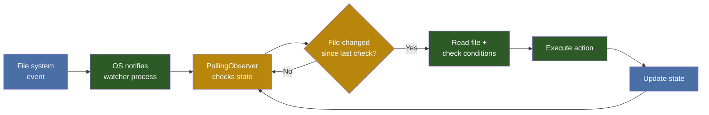

# 🔄 File Watcher Pattern

> The File Watcher pattern is the foundation of vault automation. A background process monitors directories for changes and triggers predefined actions — all without human intervention.

---

## The Pattern



---

## Why PollingObserver (Not INotify)

On Windows and network filesystems, native file notification APIs (INotify on Linux, ReadDirectoryChanges on Windows) can miss events. The `PollingObserver` from Python's `watchdog` library polls the filesystem at regular intervals — slower but reliable.

| Approach | Pros | Cons |
|----------|------|------|
| **INotify / ReadDirectoryChanges** | Instant, no CPU overhead | Misses events on network drives, Obsidian's atomic saves |
| **PollingObserver** | Reliable across all platforms, catches all changes | CPU overhead (negligible at 1-2s intervals) |

---

## The Debounce Problem

Obsidian writes files in **two phases**:
1. Writes content to a temp file
2. Renames temp to target

Without debouncing, a watcher would trigger **twice** for every save. The solution:

```
debounce_seconds = 2  # Wait 2 seconds after last change
```

Only the **second** (final) write triggers the action.

---

## State Tracking

To avoid re-processing unchanged files, the watcher maintains a state file:

```json
{
  "vocab/essen.md": "2026-07-09T10:30:00",
  "vocab/trinken.md": "2026-07-09T10:25:00",
  "vocab/fahren.md": "2026-07-08T09:15:00"
}
```

Each entry maps **file path → last processed timestamp**. On each poll cycle:
- If file mtime > stored timestamp → process it
- If file mtime == stored timestamp → skip it
- After processing → update stored timestamp

---

## Implementation Sketch

```python
from watchdog.observers import Observer
from watchdog.events import FileSystemEventHandler
import json, time, os

class VaultHandler(FileSystemEventHandler):
    def __init__(self, state_path):
        self.state = self._load_state(state_path)
    
    def on_modified(self, event):
        if not event.src_path.endswith('.md'):
            return
        if self._is_processed(event.src_path, event.src_path):
            return
        self._execute(event.src_path)
        self._mark_processed(event.src_path)
```

---

## Common Triggers

| Trigger | Condition | Action |
|---------|-----------|--------|
| `run_prompt: true` | Frontmatter field detected | Dispatch prompt |
| New vocabulary stub | File matches pattern + empty fields | Fill card |
| Daily note created | Filename matches date pattern | Populate tasks |
| New sentence | Content under specific heading | Annotate |

---

## The Triple Separation

The File Watcher pattern works best when separated into three components:

```
Watcher (senses) → Trigger (decides) → Executor (acts)
```

- **Watcher**: Only checks if something changed
- **Trigger**: Only checks if the change matters
- **Executor**: Only runs the action

This makes the system **debuggable**: if a file didn't get processed, check which layer failed.

---

## Related

- [[AI Architecture|🔌 Hook System — The Reactive Layer]]
- [[Projekte/Hook Shop|🪝 RA Hook Shop]]
- [[Projekte/Cron Shop|⏰ RA Cron Shop]]
