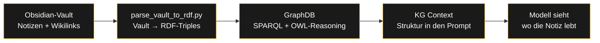

###### Related: [[Projekte/Agent Shop|Agent Shop]] | [[Projekte/Prompt Shop|Prompt Shop]] | [[Semantic Web/KG-Context-Graph|KG Context]]

---

# KG Context Service — dein Vault als Wissensgraph

> Jede Notiz weiß, wo sie lebt. Ich baue dir einen Knowledge Graph aus deinem Obsidian-Vault, damit deine Notizen sich selbst verbinden — exakt, deterministisch, null Halluzination.

Dein Vault ist voller Wissen, aber es ist **verstreut**. Notizen existieren, aber niemand weiß, wie sie zusammenhängen. Der KG Context löst genau das: Er macht die **Struktur deines Wissens** sichtbar und abfragbar.

---

## Was ich gebaut habe

Ein kompletter Knowledge-Graph-Stack, der aus einem Obsidian-Vault ein abfragbares semantisches Netz macht:

| Komponente | Was sie tut |
|------------|-------------|
| **Vault → RDF** | Jede Notiz wird zu einer Entität, jeder Wikilink zu einer Kante, jeder Tag zu einer Verbindung |
| **GraphDB (SPARQL)** | Triplestore mit OWL-Reasoning — fragt die Struktur ab: Wer verlinkt wen? Welche Tags? Welche Nachbarn? |
| **KG Context** | Injiziert die Struktur als Kontext in den Prompt — das Modell sieht, wo die Notiz im Netz lebt |
| **KGE Link Prediction** | Machine Learning (TransE) sagt fehlende Verbindungen voraus — der Graph lernt |

**Die Zahlen (live 05.09.26):**

| Metrik | Wert |
|--------|------|
| Notizen | 7.304 |
| Wikilinks | 8.198 |
| Tags | 4.850 |
| Entitäten im KGE | 7.402 |

---

## Wie es funktioniert

**Warum Struktur zählt:** Eine Notiz ist nie allein. Der Graph kennt ihre Verwandten — von wem sie verlinkt wird, welche Tags sie teilt, welche Nachbarn sie hat. Das ist Kontext, den man nicht getippt hat. Er entsteht automatisch aus der Struktur des Wissens.

**Null Halluzination:** Der KG liefert nur Verbindungen, die physisch existieren. Keine erfundenen Kanten, keine Interpretation — exakt und deterministisch.

---

## Wie du es für deine Services nutzen kannst

Der KG Context ist kein Selbstzweck — er ist die **Basis für bessere AI-Agenten**. Wenn deine Agenten wissen, wo jede Notiz im Netz lebt, arbeiten sie mit dem vollen Kontext:

| Anwendung | Nutzen |
|-----------|--------|
| **Bessere Antworten** | Der Agent sieht die Struktur + die Bedeutung — nicht nur ein Stück Text |
| **Weniger Halluzination** | Kontext basiert auf echten Verbindungen, nicht auf Vermutungen |
| **Automatische Vernetzung** | Neue Notizen werden automatisch in den Graphen eingeordnet |
| **Semantische Suche** | Frag den Graphen: "Was hängt mit diesem Thema zusammen?" |

---

## Packs & Pricing

| Pack | Was du bekommst | Preis |
|------|----------------|-------|
| 🕸️ **KG Context Setup** | Vault → RDF → GraphDB → KG Context, komplett eingerichtet | €120 |
| 🧠 **KG + RAG Fusion** | KG Context + Vektor-RAG (ChromaDB) — die vollständige Erinnerung | €180 |
| 🤖 **KG + Agenten** | KG Context + 2 Custom-Agenten, die den Graphen nutzen | €240 |
| 📦 **Komplettes KG-System** | Alles oben + KGE Link Prediction + Dashboard | **€350** |

To order: **raul.mina1@outlook.com** — include which pack(s) you want.

---

## Order

1. Fill the form below with your email and which pack you want
2. I'll send you a payment link via Ko-fi
3. After payment, you'll receive the setup files + documentation within 48 hours

**[Request Form →](mailto:raul.mina1@outlook.com?subject=KG%20Context%20Service%20Order&body=Email:%0A%0APack%20wanted:%0A%0AMessage:)** *Click to send me an email. Include your email, which pack you want, and a short description of your vault.*

> [!warning] Requirements
> You need **Obsidian** (or any Markdown vault) and **Docker Desktop** (for GraphDB). No coding required — I handle the setup.

---

> [!note] RA
> Ein Knowledge Graph ist die stille Fabrik hinter jedem guten Prompt. Die Struktur ist das Produkt.

*Welche Notiz in deinem Vault sollte sich mit was verbinden? Ich bin gespannt, was du baust. → [raul.mina1@outlook.com](mailto:raul.mina1@outlook.com)*
