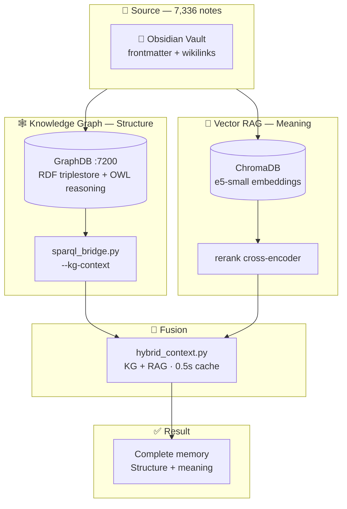

# KG Context — Semantic Context Injection for LLMs

> Every note knows where it lives. The KG Context is the **structural memory** of the system: it answers not *"what is this about"* but *"how is this connected"* — who links to it, which tags it shares, which neighbors it has. Exact, deterministic, **zero hallucination**.

## The idea in one line

A knowledge graph is only useful if a model can *use* it. **KG Context** is the bridge between a static RDF triplestore (GraphDB) and a generative model that has no native access to it. At prompt time, the system queries the graph and injects a structured block of **real, verifiable facts** — tags, backlinks, and neighboring notes — so the model answers from the vault's actual data, not from what it guesses.

## The pipeline



## Two brains, two questions

The system queries the same knowledge base with **two different "brains"**. Neither alone covers the full picture:

| Brain | Engine | What it answers | Nature |
|---|---|---|---|
| 🕸️ **Knowledge Graph (KG)** | GraphDB (SPARQL) | *How is this note connected?* — backlinks, tags, same-tag neighbors, strong ties, 2-hop | **Structure** — exact, deterministic, zero hallucination |
| 🧠 **Vector RAG** | ChromaDB + e5-small | *What is this about?* — notes that are semantically similar | **Meaning** — fuzzy, ranked by embedding similarity |

**Rule of thumb:** the KG answers *"how is this connected"* (edges, labels, facts); the RAG answers *"what does this mean"* (content, similarity). Neither alone is the full picture — that's exactly what the fusion is for.

## The three SPARQL queries

`sparql_bridge --kg-context "NOTE"` runs three queries and merges the results:

| Query | Question it answers |
|---|---|
| **Tags** | What topics does this note carry? |
| **Backlinks** | Which notes link *to* this one? |
| **Neighbors** | Which notes share tags (same-tags)? |

The output is a markdown block with `**Note:**`, `**Tags:**`, and `**Same tags:**` sections — ready to inject into any prompt.

## The anti-hallucination story (v3)

The original bridge resolved notes **by name only** (`CONTAINS` on the label). With 14 notes named "Untitled", that produced a real failure mode:

| Symptom | Root cause |
|---|---|
| Irrelevant context returned | Name collision across homonyms |
| Mixed-up tags | Tags joined from *all* matching notes |
| Wrong folder | First row's folder used |

**The key finding:** the graph wasn't hallucinating. The "weird" connections were legitimate context from *another* "Untitled" note — the bridge just couldn't tell them apart. The fix was disambiguation, not distrust.

**Fix:** a `--folder` flag filters by directory across all four queries. Without it, the bridge now emits a `⚠️ Ambigüedad: N carpetas` warning instead of silently merging. The rule of thumb: *every name query must carry `--folder`.*

## Connection discovery (v3.1)

The bridge used to only *read* existing links. `--suggest-links` makes it *discover* missing ones:

```bash
python sparql_bridge.py --suggest-links "NOTE" --folder "FOLDER" --timeout 60
```

It finds notes that share **≥1 tag** but have **no edge yet** (`FILTER NOT EXISTS`), ranks by shared-tag count, and returns a `> [!tip]+ Suggested links` block ready to inject into `see_also:`. Each run densifies the graph with discovered connections, not just hand-written ones.

## The fusion — KG + RAG in one callout

`hybrid_context.py` fuses both brains into **one callout** injected into the prompt:

```markdown
> [!info]+ Hybrid Context (KG + RAG)
> **🕸️ Knowledge Graph:**
> **Note:** [[Note Name]]
> **Tags:** tag1, tag2
> **Linked from:** [[Note A]], [[Note B]]
> **Same tags:** [[Note C]], [[Note D]]
> **🔍 Semantic (RAG):**
> > [!abstract]- 📄 Related notes (RAG)
> > **[1]** `path/to/note.md` — *heading* (sim: 0.67)
```

The model sees at once **where the note lives in the network** (structure) **and what it's about** (semantics). That's the complete memory.

## Why you need BOTH

- **The KG is exact but limited to the explicit:** it only sees connections that already exist (wikilinks, tags). If a note is *similar* but shares no tag or link, the KG **won't find it**. That's the "structural memory".
- **The RAG is flexible but approximate:** it finds similar-by-meaning even when folders/tags/links differ. But it's **fuzzy** (similarity, not fact) and can drag in noise.
- **Each covers the other's blindness:**
  - The KG gives **verifiable facts** (backlinks, tags) that the RAG can't provide semantically.
  - The RAG gives **conceptual neighbors** the KG never sees (other folders, other tags).

## Live numbers (06.09.26)

| Source | Metric | Value |
|---|---|---|
| 📁 Vault | Notes | **7,336** |
| | Wikilinks | **8,250** |
| | Tags | **4,859** |
| | NER entities | **1,114** |
| 🧠 KGE | Entities in graph | **7,800** |
| | High-confidence links | **267** |

## Measured wins

| Win | Detail |
|---|---|
| ⚡ Context latency | Cache **60s → 0.5s** for unchanged notes |
| 🎯 RAG quality | Cross-encoder rerank dropped a false positive from sim **0.963 → 0.243**, promoting the correct result |
| 🛡️ Anti-hallucination | KG context exact — every link physically exists in the vault |
| 🔀 Disambiguation | `--folder` resolves homonyms (14 "Untitled" notes), no mixed context |

## The next step — KGE link prediction

The graph doesn't just answer queries — it can **learn**. A **TransE** knowledge-graph embedding trained on the real triples predicts missing connections:

- **1,925 orphaned notes** (48% had no wikilink) → **9,625 suggestions** → **266 high-confidence links** written as `see_also`, **0 corrupt, 0 dangling**.
- **MRR 0.1985** — **1.49×** over the co-occurrence baseline.
- TransE chosen over RotatE because RotatE **memorized** the small graph (perfect 1.0 = overfitting, not victory).

> [!note] RA
> The graph doesn't invent connections. It only surfaces the ones you already made — and shows you the ones you haven't yet.

---

## Related

- [GraphDB — RDF Triplestore](/Semantic-Web/GraphDB)
- [SPARQL — Query Language](/Semantic-Web/SPARQL)
- [Knowledge Graphs](/Semantic-Web/Knowledge-Graphs)
- [KG Context vs RAG](/Semantic-Web/KG-Context-vs-RAG)
- [KGE Link Prediction](/Projekte/KGE-Link-Prediction-YellowVault)
- [AI Ecosystem — Data Pipeline](/Projekte/AI-Ecosystem-Data-Pipeline)
