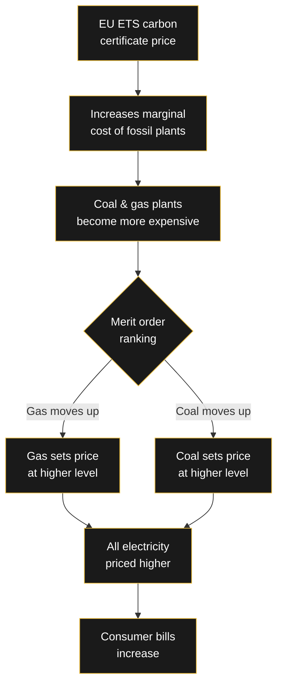

# 🌍 CO₂ Costs and Their Impact on German Electricity Prices

> Carbon pricing doesn't just affect polluters — it flows directly through the electricity market to every consumer's bill. This is how CO₂ costs become electricity costs in Germany.

---

## The Mechanism

In the European Union Emissions Trading System (EU ETS), power plants must buy emission certificates for every tonne of CO₂ they emit. These costs become part of the plant's **marginal cost** — and through the merit order system, they set the market price for all electricity.

---

## The Math

As of mid-2026, the EU ETS certificate price is approximately **€75 per tonne of CO₂**.

For a natural gas plant (emitting ~0.4 tCO₂/MWh):
- CO₂ cost added: 0.4 × €75 = **€30/MWh**
- Base marginal cost: ~€50-60/MWh
- Effective marginal cost: **€80-90/MWh**

For a coal plant (emitting ~0.9 tCO₂/MWh):
- CO₂ cost added: 0.9 × €75 = **€67.5/MWh**
- Base marginal cost: ~€30-40/MWh
- Effective marginal cost: **€97-107/MWh**

This means CO₂ costs are now a **major component** of electricity prices in Germany.

---

## 2022 Crisis: What Happens When Gas Spikes

During the 2022 energy crisis, natural gas prices increased 5-10x. Because gas plants were often the marginal price-setter, electricity prices across Germany rose dramatically — even though most power came from cheaper sources.

| Metric | Normal (2021) | Crisis (2022) |
|--------|--------------|---------------|
| Gas price (€/MWh) | ~20 | ~150-200 |
| CO₂ price (€/t) | ~55 | ~80 |
| Electricity base price (€/MWh) | ~50-80 | ~200-400 |
| Household cost increase | — | ~2-3x |

---

## Solutions & Reforms

### 1. Decoupling gas from electricity prices
France and Spain have proposed removing gas plants from the marginal pricing mechanism. Under this model, infra-marginal generators (renewables, nuclear) would receive their actual costs, not the gas-set price.

### 2. Power Purchase Agreements (PPAs)
Long-term contracts between renewable producers and consumers lock in stable prices, insulating buyers from spot market volatility.

### 3. Energy storage
Batteries and pumped hydro can absorb excess renewable generation during low-demand hours and discharge during peak demand, reducing the need for gas peaker plants.

---

## Why This Matters for Germany

Germany's **Energiewende** (energy transition) aims to phase out coal by 2038 and achieve carbon neutrality by 2045. But as long as fossil plants set the marginal price, decarbonization doesn't immediately translate to lower consumer prices.

The paradox: more renewables → less fossil generation → but when fossil is needed, its price (amplified by CO₂ costs) sets the market.

---

## Related

- [[Wirtschaft/Merit-Order-System|⚡ How Germany's Electricity Market Sets Prices]]
- [[Engineering/Hydrogen-Pathways|🧪 Hydrogen Production Pathways]]

---
*As long as fossil plants set the marginal price, decarbonization doesn't lower consumer bills. How should Germany resolve this paradox?*
