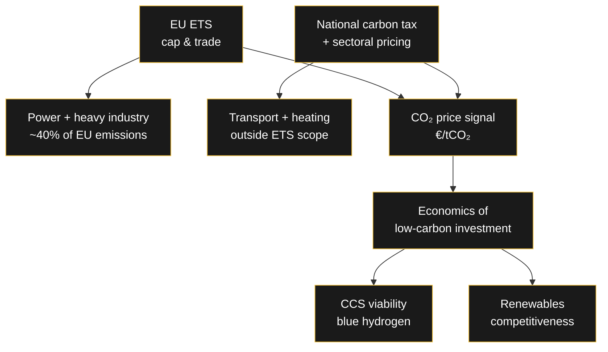

# 💶 Germany's Carbon Pricing Mechanisms

> Germany doesn't have one carbon price — it has a system of overlapping mechanisms. The EU ETS sets the price for power and heavy industry, while national carbon pricing covers the rest. Together, they decide the economics of every ton of CO₂ emitted — and every ton captured.

---

## The Two Main Instruments

### 1. The EU Emissions Trading System (EU ETS)

Launched in **2005**, the EU ETS is the **world's first carbon market**. It operates on the "cap and trade" principle:

- A **cap** limits total GHG emissions from covered installations
- The cap is **reduced annually** in line with EU climate targets
- One allowance = the right to emit **one tonne of CO₂-equivalent**
- Allowances are **auctioned** and can be **traded** between companies

**Coverage:** electricity and heat generation, industrial manufacturing, maritime transport (from 2024), and aviation — roughly **40% of total EU GHG emissions**.

**Track record:** by 2023, emissions from European power and industry plants were down **~47%** vs. 2005 levels. Since 2013, the system has raised **over €175 billion** in revenue — flowing to national budgets for renewables, efficiency, and low-carbon tech, plus the EU Innovation and Modernisation Funds.

**How compliance works:**
- Companies monitor and report emissions yearly
- They must surrender enough allowances to cover their annual emissions
- Heavy fines for non-compliance
- Excess allowances can be sold or banked

### 2. The National Carbon Tax

Alongside the ETS, Germany applies carbon taxation on emissions outside the ETS scope — notably **transport and heating fuels**.

Key characteristics:

| Feature | Detail |
|---|---|
| Mechanism | Price per tonne of CO₂ emitted |
| Effect | Incentivizes low-emission alternatives |
| Industry relief | Companies facing international competition pay **~60% less** per tonne |
| Weak spot | Where consumers have no alternatives, the tax shows little steering effect (e.g., transport) |

> [!note] RA
> The carbon tax's weakness is real: if you have no alternative to driving, a higher tax just costs you money — it doesn't change behavior. That's why the ETS + tax combination matters more than either alone.

---

## The Chemistry of Carbon Costs in Projects

For an industrial project, carbon pricing enters the economics at multiple points:

| Cost component | What it is |
|---|---|
| **Process carbon tax** | Price on the plant's remaining (uncaptured) CO₂ emissions |
| **Upstream carbon tax** | Price on supply-chain emissions — natural gas production & processing, methane leakage, gas transport, electricity input (as CO₂-equivalent) |
| **ETS certificates** | Market price per tonne for covered installations |

For a blue hydrogen plant with CCS, these mechanisms create the **incremental value of capture**: every tonne of CO₂ captured and stored avoids a tonne of carbon cost. The higher the carbon price, the stronger the business case for CCS.

---

## How the Mechanisms Interact

---

## The Debate: Is the Price High Enough?

Critics argue the carbon price has been **too low to drive innovation**. Two recurring points:

1. **Global coverage gap** — a European carbon price is distorted if major emitters (e.g., China) don't face comparable costs; competitiveness relief for exposed industries blunts the signal
2. **Behavioral limits** — carbon taxes only steer behavior where affordable alternatives exist; in transport and heating, demand is inelastic in the short run

The 2022 energy crisis showed how this plays out: CO₂ costs flowing through the electricity market amplified price spikes (see [[Wirtschaft/CO2-Kosten|CO₂ Costs and Electricity Prices]]). Meanwhile, higher ETS prices strengthen the case for CCS and green hydrogen — the mechanism doing exactly what it was designed to do.

---

## Related

- [[Wirtschaft/CO2-Kosten|🌍 CO₂ Costs and Their Impact on German Electricity Prices]]
- [[Wirtschaft/Merit-Order-System|⚡ How Germany's Electricity Market Sets Prices]]
- [[Engineering/CO2-Value-Chain|🗺️ The CO₂ Value Chain]]
- [[Engineering/Hydrogen-Demand-Germany|📈 Hydrogen Demand in Germany]]

---

*Carbon pricing is the quiet engine of the energy transition — every euro per tonne changes investment decisions somewhere. Is €75/t enough to make CCS real, or does it need to go higher?*
