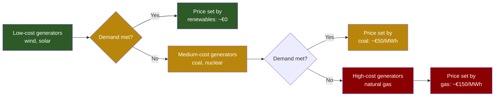

# ⚡ How Germany's Electricity Market Sets Prices

> In Germany, the price of electricity is not determined by average production costs. It is set by the **last and most expensive power plant** needed to meet demand at any given moment. This is the **merit order system**.

---

## Marginal Cost Pricing

Marginal cost pricing means that the price of electricity is set by the **last unit of electricity needed to meet demand** at any given time. This is particularly relevant in energy markets where different generation technologies have varying costs.

**Example: Germany's Electricity Market**

- Germany has a mix of **renewables (wind, solar, hydro), nuclear, coal, and natural gas**.
- When demand is **low**, cheap renewables (solar and wind) dominate, leading to lower prices.
- When demand **rises** and renewables can't supply enough power, more expensive power plants (natural gas, coal) must be used.
- Since **natural gas plants have higher marginal costs** (due to fuel and CO₂ costs), they set the market price for all electricity at that moment.

---

## The Merit Order System

The **spot market** determines electricity prices in real time based on supply and demand. The **most expensive generator needed to meet demand** at any given moment sets the price. This is called the **merit order system**:

1. **Generators with the lowest marginal costs** (e.g., renewables) are used first.
2. **If demand increases**, more expensive sources like coal and gas-fired power plants are added.
3. **The last (most expensive) generator** needed to meet demand sets the final market price.

---

## Example in Action

Let's assume the following energy sources are available in Germany at a given hour:

| Energy Source | Capacity Available (MW) | Marginal Cost (€/MWh) |
|---|---|---|
| Wind Power | 5,000 | **€0** (free fuel) |
| Solar Power | 3,000 | **€0** (free fuel) |
| Coal | 4,000 | **€50** |
| Natural Gas | 2,000 | **€150** |

- If demand is **6,000 MW**: wind and solar cover it at **€0/MWh**
- If demand rises to **10,000 MW**: coal plants come online → price at **€50/MWh**
- If demand jumps to **12,000 MW**: natural gas plants are needed → price at **€150/MWh** (even though most energy comes from cheaper sources!)

---

## Why This Matters

✅ **Advantages of the merit order system:**
- Encourages investment in **renewables** (which lower average costs)
- Ensures **real-time market efficiency** by matching supply and demand

❌ **Problems:**
- Leads to **high electricity prices** when gas prices spike
- Consumers **pay higher prices even if renewables generate most of the electricity**

💡 **Possible Reforms:**
- **Decoupling gas from electricity prices** (France & Spain proposed capping gas prices)
- **More long-term contracts (PPAs)** for renewables to stabilize prices
- **Investing in energy storage** (batteries) to reduce reliance on gas during high demand

---

## Impact of CO₂ Costs

CO₂ pricing adds another layer to the merit order. Since natural gas and coal plants must buy emission certificates, their effective marginal cost increases. The CO₂ cost flows through the merit order directly to the consumer price.

> For a deeper look at CO₂ costs: [[Wirtschaft/CO2-Kosten|CO₂ Costs and Their Impact on German Electricity Prices]]

---

## Related

- [[Wirtschaft/CO2-Kosten|🌍 CO₂ Costs and Their Impact on German Electricity Prices]]
- [[Engineering/Hydrogen-Pathways|🧪 Hydrogen Production Pathways]]
